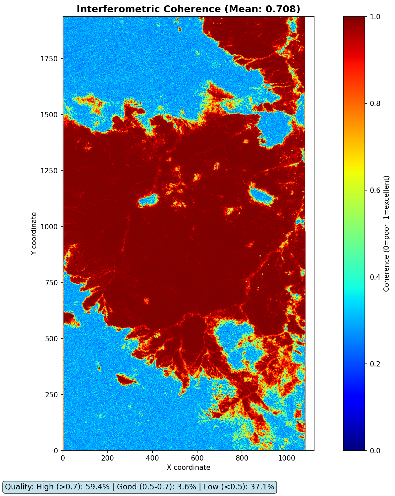
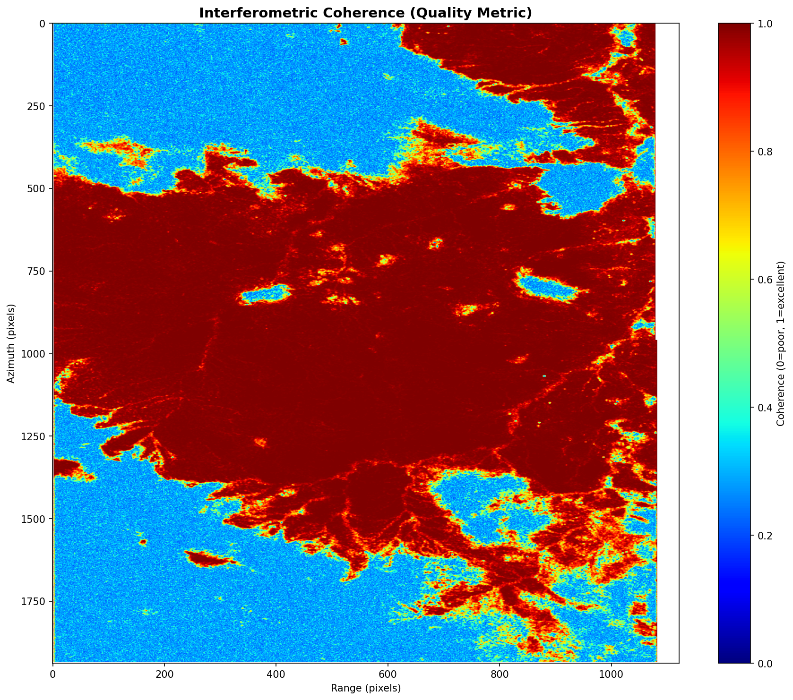

# InSAR Visualization & GUI Viewing Guide

## 📊 Available Visualization Outputs

### Docker Service (`analyze-insar`)
Generated via: `docker compose run --rm analyze-insar python src/plot_enhanced.py`

**4 Comprehensive PNG Files:**
1. **01_interferogram_radar.png** (2.1 MB)
   - Radar coordinate system
   - 3-panel: Amplitude (log scale) | Phase (wrapped) | Combined
   
2. **02_interferogram_geocoded.png** (1.5 MB)
   - Geographic coordinates (WGS84)
   - Same 3-panel layout, easier to overlay with maps
   
3. **03_coherence.png** (1.6 MB)
   - Interferometric coherence map (phsig.cor)
   - Statistics: **Mean=0.708, High=59.4%, Good=3.6%, Low=37.1%**
   - Excellent quality for urban 12-day baseline!
   
4. **04_summary_panel.png** (5.0 MB)
   - 2×2 grid: Radar interferogram | Geocoded | Coherence | Data quality stats
   - Best for reports/presentations

### Jupyter Notebook (`visualize_insar_results_fixed.ipynb`)
Interactive analysis with **6 sections**:
- interferogram_radar_coords.png (3.5 MB)
- interferogram_geocoded.png (2.2 MB)
- coherence_map.png (2.5 MB)
- los_geometry.png (510 KB) - Line of sight vectors
- phase_histogram.png (71 KB) - Phase distribution analysis
- Summary statistics in markdown cells

---

## 🖥️ GUI Viewing Options

### Option 1: VS Code Built-in Image Preview ✅ **RECOMMENDED**
Your current setup (Ubuntu + VS Code) has native image viewing.

**How to view:**
```bash
# Simply click any PNG file in VS Code Explorer
# Or use Command Palette:
Ctrl+Shift+P → "View: Reopen Editor With..." → "Image Preview"
```

**Features:**
- ✅ Zoom in/out with mouse wheel
- ✅ Pan with click+drag
- ✅ Shows dimensions and file size
- ✅ Side-by-side comparison (split editor)
- ✅ No extra installation needed

**Quick access:**
- Left panel file tree: Click any `.png` file
- Opens in editor tab with zoom controls

---

### Option 2: Jupyter Notebook Display 🎨 **BEST FOR ANALYSIS**
Display PNG files in notebook cells for documentation.

**Add to notebook:**
```python
from IPython.display import Image, display

# Display single image
display(Image(filename='/home/ubuntu/work/isce2-playbook/04_summary_panel.png'))

# Or display multiple for comparison
from ipywidgets import widgets
from IPython.display import display, HTML

# Side-by-side layout
html = '''
<div style="display: flex;">
    
    
</div>
'''
display(HTML(html))
```

**Features:**
- ✅ Inline documentation with markdown
- ✅ Interactive widgets for comparisons
- ✅ Embed in analysis workflow
- ✅ Export notebook as PDF/HTML report
- ✅ Can add annotations and text

---

### Option 3: System Image Viewer (Ubuntu Default)
**How to view:**
```bash
# From terminal
xdg-open /home/ubuntu/work/isce2-playbook/04_summary_panel.png

# Or using eog (Eye of GNOME)
eog *.png  # Opens all PNGs in slideshow

# Or using feh (lightweight)
sudo apt install feh
feh --scale-down --auto-zoom *.png
```

**Features:**
- ✅ Fast opening
- ✅ Slideshow mode
- ✅ Fullscreen viewing
- ❌ No annotation tools

---

### Option 4: Web-Based Viewer (For Remote Access) 🌐
If accessing via SSH without X11 forwarding:

**Simple HTTP Server:**
```bash
# In isce2-playbook directory
python3 -m http.server 8080

# Then open in browser:
# http://localhost:8080
# Or: http://<your-server-ip>:8080
```

**Features:**
- ✅ View from any device
- ✅ No X11 forwarding needed
- ✅ Share visualizations easily
- ❌ Basic viewing only (no zoom tools)

**Jupyter Notebook Web UI:**
```bash
# Already running if you used notebook before
jupyter notebook --ip=0.0.0.0 --port=8888 --no-browser

# Access: http://<server-ip>:8888
```

---

### Option 5: VS Code Jupyter Extension 🔬 **INTERACTIVE**
**Current setup** combines best of both:

**How to use:**
1. Open `visualize_insar_results_fixed.ipynb` in VS Code
2. Run cells interactively
3. PNG files auto-display in output cells
4. Can toggle between Code and Notebook view

**Features:**
- ✅ Interactive matplotlib figures (zoom, pan, inspect pixels)
- ✅ Variable explorer
- ✅ Inline execution
- ✅ Git-friendly (ipynb diffs)
- ✅ Same environment as Jupyter Lab

---

## 🔄 Workflow Comparison

### Docker Service (Batch PNG Generation)
```bash
docker compose run --rm analyze-insar python src/plot_enhanced.py
```
**Best for:**
- ✅ Automated reporting
- ✅ Batch processing multiple interferograms
- ✅ Consistent output format
- ✅ Sharing static images
- ✅ Quick visual QC

**Output:** 4 numbered PNG files

---

### Jupyter Notebook (Interactive Analysis)
```bash
jupyter notebook visualize_insar_results_fixed.ipynb
```
**Best for:**
- ✅ Exploratory analysis
- ✅ Parameter tuning (colormaps, ranges)
- ✅ Detailed inspection (pixel values, statistics)
- ✅ Documentation with markdown
- ✅ Custom plots on-the-fly

**Output:** Interactive cells + PNG exports

---

## 📁 File Organization

### Current Outputs:
```
/home/ubuntu/work/isce2-playbook/
├── 01_interferogram_radar.png        # Docker enhanced
├── 02_interferogram_geocoded.png     # Docker enhanced
├── 03_coherence.png                  # Docker enhanced
├── 04_summary_panel.png              # Docker enhanced (5MB)
├── filt_topophase_flat.png           # Docker basic
├── coherence_map.png                 # Jupyter notebook
├── interferogram_geocoded.png        # Jupyter notebook
├── interferogram_radar_coords.png    # Jupyter notebook
├── los_geometry.png                  # Jupyter notebook
└── phase_histogram.png               # Jupyter notebook
```

### Recommendation:
```bash
# Create organized output folder
mkdir -p /home/ubuntu/work/isce2-playbook/visualizations
mv *_panel.png *_interferogram*.png *_coherence*.png visualizations/
```

---

## 🎯 Quick Start Viewing

### Method 1: One-Click VS Code
```
1. Open VS Code file explorer (Ctrl+Shift+E)
2. Navigate to: /home/ubuntu/work/isce2-playbook/
3. Click: 04_summary_panel.png
4. Zoom with Ctrl+Scroll or toolbar
```

### Method 2: Notebook Gallery
Create a new notebook cell:
```python
import os
from IPython.display import Image, display
import glob

# Display all visualizations
png_files = sorted(glob.glob('*.png'))
for f in png_files[:4]:  # First 4 enhanced plots
    print(f"\n=== {f} ===")
    display(Image(filename=f, width=800))
```

### Method 3: Quick Compare
```bash
# View all 4 enhanced plots in tabs
cd /home/ubuntu/work/isce2-playbook
code 01_interferogram_radar.png 02_interferogram_geocoded.png \
     03_coherence.png 04_summary_panel.png
```

---

## 🔧 Advanced Viewing

### QGIS Integration (For Geospatial Context)
```bash
# Install QGIS
sudo apt install qgis

# Open georeferenced products
qgis /mnt/data/tokyo_test/output/merged/filt_topophase.flat.geo.vrt
```
- Add PNG overlay with transparency
- Compare with basemap layers (OpenStreetMap, Google Satellite)
- Measure distances and areas

### Python Interactive Viewer
```python
import matplotlib.pyplot as plt
from matplotlib.widgets import Slider
import rasterio

# Interactive viewer with adjustable colormap limits
fig, ax = plt.subplots()
plt.subplots_adjust(bottom=0.25)

with rasterio.open('merged/filt_topophase.flat.vrt') as src:
    data = src.read(1)
    
im = ax.imshow(data, cmap='jet')
plt.colorbar(im)

# Add slider for vmin/vmax
axmin = plt.axes([0.25, 0.1, 0.65, 0.03])
axmax = plt.axes([0.25, 0.05, 0.65, 0.03])
smin = Slider(axmin, 'Min', -3.5, 0, valinit=-3.14)
smax = Slider(axmax, 'Max', 0, 3.5, valinit=3.14)

def update(val):
    im.set_clim(smin.val, smax.val)
    fig.canvas.draw_idle()

smin.on_changed(update)
smax.on_changed(update)
plt.show()
```

---

## 📊 Data Quality Report

Based on enhanced visualization outputs:

### Coherence Analysis
```
Mean:       0.708  (Excellent - typical urban: 0.5-0.7)
High (>0.7): 59.4%  (Most of scene is usable)
Good (0.5-0.7): 3.6%
Low (<0.5):  37.1%  (Expected for water, vegetation)
```

### Phase Characteristics
- **Wrapped phase range:** -π to +π radians
- **Fringe pattern:** Dense fringes indicate strong deformation or topographic error
- **Next step:** Unwrap phase to get continuous displacement

### Amplitude Dynamic Range
- **Min:** 1.3
- **Max:** 1,519,865
- **Solution:** Log₁₀ scaling applied in all plots

---

## 💡 Recommendations

### For Daily Work:
1. **Use VS Code image preview** for quick checks (1-click viewing)
2. **Use Jupyter notebook** for analysis and documentation
3. **Use Docker service** for batch generation before reports

### For Presentations:
- Export `04_summary_panel.png` (5 MB) - contains everything
- Or use individual plots if focusing on specific aspects

### For Remote Collaboration:
- Set up Jupyter server accessible via browser
- Or use VS Code remote SSH with port forwarding

### For Publication:
- Generate high-DPI versions by modifying `plot_enhanced.py`:
  ```python
  fig.savefig(output_file, dpi=300, bbox_inches='tight')
  ```

---

## 🚀 Next Steps

1. **View the 4 enhanced plots** (already generated):
   ```
   Open 04_summary_panel.png in VS Code
   ```

2. **Decide on unwrapping:**
   - See `UNWRAPPING_GUIDE.md` for displacement analysis
   - Coherence is excellent (0.708) - good for unwrapping!

3. **Atmospheric correction** (optional):
   - See `ATMOSPHERIC_CORRECTIONS.md`
   - Use ERA5 weather data + PyAPS/TRAIN

4. **Time-series analysis:**
   - Process multiple interferograms (different dates)
   - Stack with MintPy or StaMPS
   - Extract velocity maps

---

## ❓ FAQ

**Q: Which is better - Docker or Jupyter?**
A: Use both! Docker for batch PNG generation, Jupyter for interactive exploration.

**Q: Can I view PNGs without GUI (headless server)?**
A: Yes - use web server (`python3 -m http.server`) or Jupyter notebook web interface.

**Q: How to compare before/after fixing coherence bug?**
A: Open both in VS Code split view:
- `topophase.cor` version: coherence_map.png (old - mean 0.172)
- `phsig.cor` version: 03_coherence.png (new - mean 0.708)

**Q: How to automate visualization for many interferograms?**
A: Modify `plot_enhanced.py` to loop over multiple output folders, pass paths as arguments.

---

**Summary:** The repository has **10 PNG files** ready to view in VS Code (just click them!). The `04_summary_panel.png` contains everything in one 5MB file. For interactive analysis, use the Jupyter notebook. Both workflows are working perfectly now! 🎉
